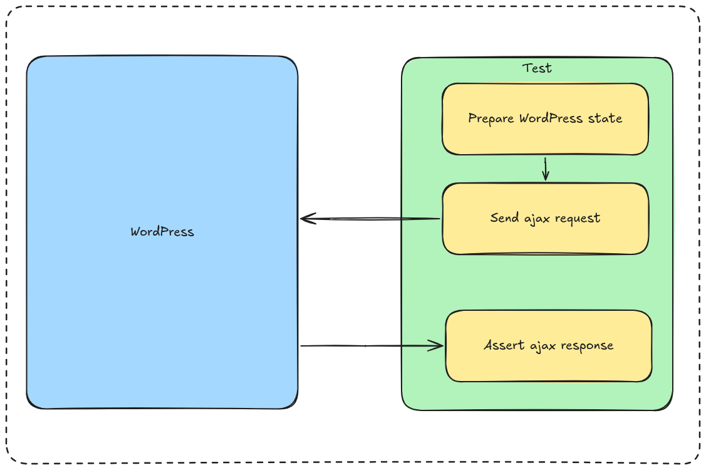

Today most of the websites are required to react to the user in a low time and without refreshing the page.
This is often done using API calls.

However, in WordPress this is done using Ajax most of the time, making it an important tool.
Knowing to testing it, makes it vital to keep the plugin stable and keep the quality of the code high in the long term.



To handle that case, we will have to simulate the Ajax call and verify that the result is the correct one.

To do that we can extend our class from `WP_Ajax_UnitTestCase` which is going to give us access to `_handleAjax` method which simulate the AJAX call for us.

We will reuse that method inside `callAjaxAction` which is going to simplify the usage of this method:

```php
/**  
 * Calls the Ajax Action. 
 */
 protected function callAjaxAction(string $action) {  
    try {  
       $this->_handleAjax( $action );  
    } catch ( WPAjaxDieContinueException $e ) {  
	    return false;
    }  
  
    return json_decode( $this->_last_response );
}
```

Once this method is added to the class we can now work with it to simulate the Ajax call:
First we will have to set up parameters for that we need at least to set up `nonce` :

```php
$_POST['nonce']  = wp_create_nonce( 'my-nonce' );
```

Then we can use the  method `callAjaxAction` to simulate the call:

```php
$response = $this->callAjaxAction('my-action');
```

Finally, we can make assertions on the state of the application or the response.