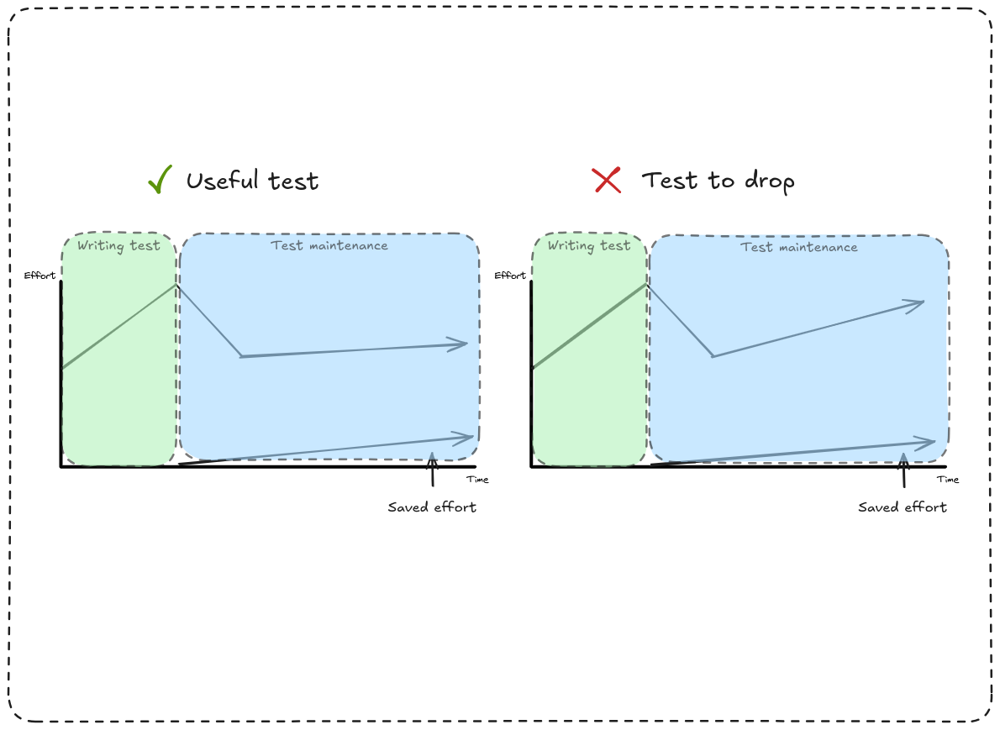
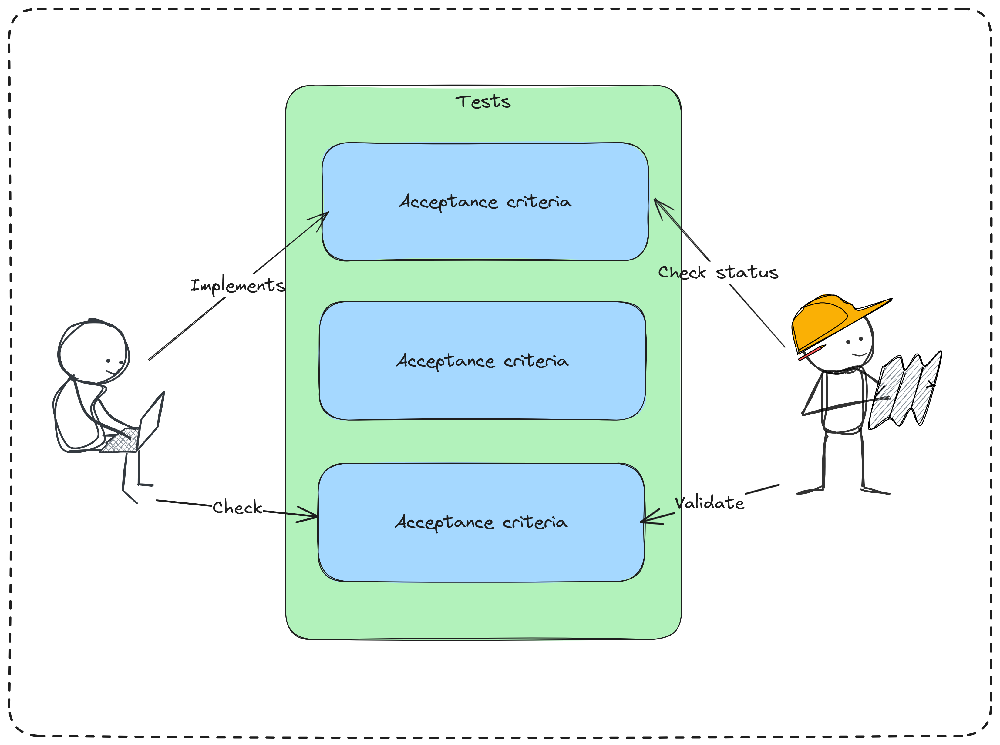

# Testing

While automated testing is often praised, it is important to remember that they are just a tool with their pros and cons.

That is why it is important to get them right to not end up with a burden slowing your developing workflow.

## Testing everything you should not

Automating a test is not mandatory, and there are cases there you should not automate them.

To understand this, you should consider the time you will spend on creating and maintaining the test as an investment.

All that will make the difference between automated and manual testing is if the time you are going to save from the test running will be higher from the time you invested.

That way, achieving high coverage is still an objective, but achieving 100% coverage is in fact a way to detect something wrong in the practices.

## You should plan your moves

You would not start to implement a feature without planning before, right?

For testing, it is the same, and this is why it is important to make sure to define a testing strategy adapted to the current project but also to the size of the company.

This is exactly why we defined [a general testing strategy](./strategy.md) in WP Media that every project can adapt to its own specifies when it is necessary.

## Communication is key

Tests are not only a way to check everything is correct but also a great way to have documentation that never lies as it is simple to catch out any mistake.

That way you should always keep your test simple and test only one thing per test.
This will make your tests easier to understand for others.

In the same fashion, you should always try to keep the name from your tests descriptive to make them straightforward to any other developer.

