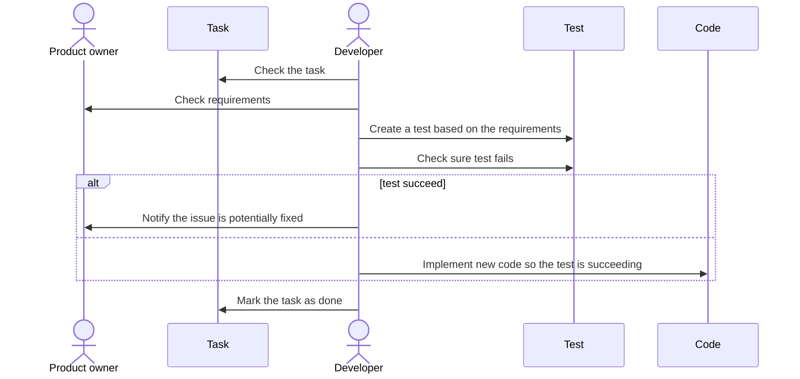
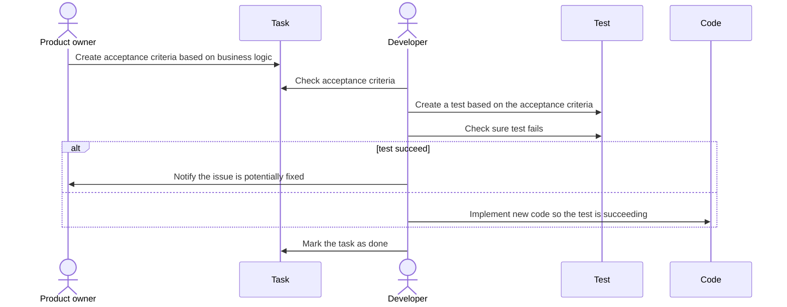

# Strategy

The testing strategy is one of the key aspects to consider when testing as this what will help us to focus on what matters to us.

## WP Media testing strategy

As we are a small team, your time is valuable and limited, so we cannot afford to spend this precious resource on automating fragile tests that will end up costing us more than what we invested.

### We build Diamonds not pyramids

To avoid fragile tests are using a testing strategy based mainly on integration tests and try to rely as little as possible on unit tests.

This makes our testing pyramid look more like a diamond as integration tests are more numerous than your unit tests.

The choice of integration tests over unit ones is related to multiple reasons.

First, they are black box tests or in other words, they do not rely on the implementation of the application unlike unit tests which are close to the implementation.

This allows tests to be anti-fragile and ease the amount of maintenance required by our tests.

Second, we value tests as a way to communicate by using integration tests primary instead of unit tests, we are putting business requirements at the center of our testing process allowing communication with the product team and QA.

### Acceptance criteria are the base

When testing, it is not possible to test everything, and there is always a moment we need to stop.

To create a clear limit, we decided to use acceptance criteria to guide our tests.

Acceptance criteria are a couple of sentences each one describing an atomic behavior from the application that should be met once the task is done.

This way it is now possible for the developer to easily check the changes are following requirements without having any assistance from the person who created the task.

This can seem a bit overkill. However, often tasks can stack up in the backlog for weeks if it is not months or years. Having the done description in this case is even more useful as in this case the person who created the task might have forgot what was the initial request.

**Without Acceptance criteria**

**With Acceptance criteria**

To create a valid acceptance criteria, we need always to have at least three parts respecting the AAA framework:
- **Arrange**: In the first part of the acceptance criteria, we need to define the initial state.
- **Act**: This part is here to describe the part of the code that will be executed and so tested.
- **Assert**: The goal from that last part is to make sure that we are in the state we expect.

### The best code is no code

Each line of code ever wrote will add up to the legacy that you will have to maintain.

This is the reason why we always want to write our test before changing any line of code inside the application.

That way we can check if we can achieve the ultimate clean code by implementing the required change without changing any line of code if the test turns out passing right after we created it.

